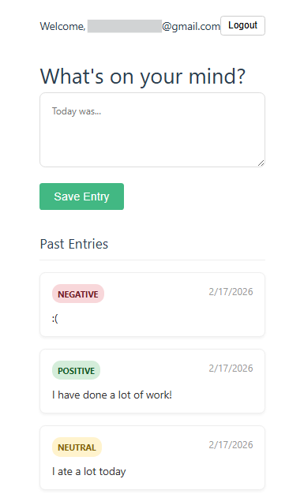

# 📓 Smart Journal AI


A full-stack application that uses Google's Gemini AI to analyze the sentiment of personal journal entries in real-time. It features a modern Vue 3 frontend, a Node.js/Express backend, and persistent data storage via Supabase.

## 🚀 Features

-   **AI-Powered Analysis:** Automatically detects the mood (Positive, Negative, Neutral) of journal entries using Google Gemini 3.0 Flash.
-   **History View:** View a chronological list of past journal entries with color-coded mood tags.
-   **Secure Authentication:** User login via Google OAuth (managed by Supabase Auth).
-   **Private Data:** Row Level Security (RLS) ensures users can only access their own journal entries.
-   **Real-time Database:** Stores journal entries and analysis results instantly in Supabase (PostgreSQL).
-   **RESTful API:** Custom Node.js backend handling data processing and secure API communication.
-   **Modern Frontend:** Built with Vue 3 (Composition API) and Vite for a fast, reactive user experience.
-   **Security:** Environment variables used for API key protection.

## 🛠️ Tech Stack

-   **Frontend:** Vue.js 3, Vite, JavaScript
-   **Backend:** Node.js v24, Express.js
-   **Database:** Supabase (PostgreSQL) + Auth
-   **AI Model:** Google Gemini 3.0 Flash (via Google Generative AI SDK)

## ⚙️ Prerequisites

Before running this project, ensure you have the following:

-   Node.js (v20 or higher recommended)
-   A [Supabase](https://supabase.com/) account and project.
-   A [Google Cloud](https://console.cloud.google.com/) Project (for OAuth keys).
-   A [Google AI Studio](https://aistudio.google.com/) API Key.

## 📦 Installation & Setup

### 1. Clone the Repository
```bash
git clone [https://github.com/kamanl16/smart-journal.git](https://github.com/kamanl16/smart-journal.git)
cd smart-journal
```

### 2. Backend Setup
The backend runs on localhost:3000.
```bash
# Install backend dependencies
npm install
# Create a .env file in the root directory
touch .env
```
Create a .env file in the ROOT directory:
```bash
GEMINI_API_KEY=your_google_gemini_key_here
SUPABASE_URL=your_supabase_project_url
SUPABASE_SERVICE_KEY=your_supabase_service_role_key
```

### 3. Frontend Setup
The frontend runs on localhost:5173 and proxies API requests to the backend.
```bash
cd client
npm install
```
Create a .env file in the CLIENT directory: Vite requires variables to start with VITE_.
```bash
VITE_SUPABASE_URL=your_supabase_project_url
VITE_SUPABASE_ANON_KEY=your_supabase_anon_key
```

## 🏃‍♂️ Usage

You need to run the backend and frontend in two separate terminal windows.

Terminal 1 (Backend):
```bash
# From the root folder
node server.js
```

Terminal 2 (Frontend):
```bash
# From the client folder
cd client
npm run dev
```

Open your browser and navigate to http://localhost:5173.

## 🗄️ Database Schema

This project uses a single table in Supabase named journal_entries.
| Column | Type | Description |
| :---------- | :-------- | :---------- |
| `id` | `int8` | Primary Key |
| `created_at` | `timestamptz` | The user's journal entry |
| `content` | `text` | Auto-generated timestamp |
| `mood` | `text` | AI-generated sentiment analysis |
| `user_id` | `uuid` | Linked to auth.users (Foreign Key) |

Security Policies (RLS):
-   Enable RLS on journal_entries.
-   Policy: Users can only INSERT and SELECT rows where auth.uid() = user_id.

## 📄 License
This project is licensed under the terms of the [MIT License](LICENSE.md).

